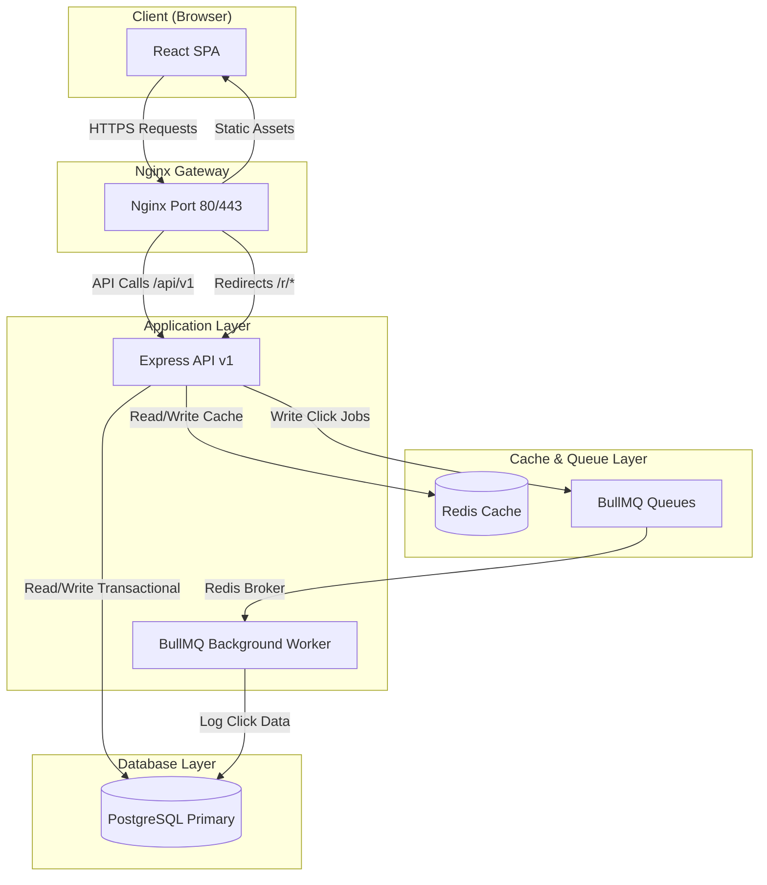

# Linkly — Production-Grade URL Management SaaS Platform

Linkly is a highly scalable, enterprise-ready URL management and redirection platform (similar to Bitly) featuring a polished **React (Vite + TypeScript)** dashboard, a high-performance **Node.js/Express** backend, **PostgreSQL** persistence, **Redis** caching, and a background **BullMQ** worker queue.

---

## 🚀 Key Features

- **Lightning-Fast Redirection**: Employs a cache-aside design using Redis to resolve redirects in milliseconds.
- **Asynchronous Click Analytics**: Click tracking is handled in background workers using BullMQ to keep redirect responses non-blocking.
- **Deep Analytics breakdowns**: Visualizes daily click volume trends, device classes, operating systems, browsers, geo-locations, and referrers via interactive charts.
- **Secure Link Settings**: Offers password protection, link expiration dates, and configurable custom aliases.
- **Team Workspaces**: Supports shared workspaces allowing collaborative link management, role delegation, and access control.
- **Developer API Access**: Built-in developer settings allowing programmatic link generation via custom API keys.
- **Global Rate Limiting**: Implements standard and login-specific rate-limiting rules at Nginx and application levels.

---

## 🛠️ Technology Stack

| Layer | Technology | Key Capabilities |
|---|---|---|
| **Frontend** | React 18, Vite, TypeScript | SPA architecture, TanStack Query (React Query) v5, Tailwind CSS, Recharts |
| **Backend** | Node.js, Express, TypeScript | REST API v1, Zod schema validation, JWT Access/Refresh authentication |
| **Database** | PostgreSQL 16 | Relational persistence, connection pooling via `pg`, raw SQL indexes |
| **Cache & Queue** | Redis, BullMQ | Cache-aside lookup, asynchronous job processing, exponential backoff |
| **Proxy & Gateway** | Nginx | SSL termination, routing (`/api` vs `/r` vs `/`), client rate-limits |
| **DevOps** | Docker, Docker Compose | Containerized dev/prod orchestration, GitHub Actions CI/CD pipelines |

---

## 🏗️ System Architecture



---

## ⚡ Quick Start

### Prerequisites
- **Docker** (version 24+)
- **Docker Compose** (version 2.20+)

### Setup and Start
1. **Clone the repository**:
   ```bash
   git clone https://github.com/pradeepmajji853/Scalable-URL-Management-Platform.git
   cd Scalable-URL-Management-Platform
   ```
2. **Setup environment secrets**:
   ```bash
   cp .env.example .env
   ```
3. **Start the containers**:
   ```bash
   docker compose up --build -d
   ```
4. **Access the services**:
   - **Frontend Dashboard**: [http://localhost](http://localhost)
   - **Swagger API Documentation**: [http://localhost/api/docs](http://localhost/api/docs)

---

## 📂 Project Structure

```
Scalable-URL-Management-Platform/
├── frontend/             # React + Vite + TypeScript Client App
├── backend/              # Node.js + Express API & Job Workers
├── nginx/                # Reverse proxy configurations & TLS SSL setup
├── docs/                 # Platform architecture, API specification, & deployment guides
├── docker-compose.yml    # Main services orchestrator
└── README.md             # Project landing documentation
```

---

## 📖 In-Depth Documentation

Detailed design specifications can be found under the `/docs` directory:
- [System Architecture Details](file:///docs/architecture.md) — Exhaustive breakdowns of DB indexes, cache mappings, and workers.
- [API Specification Spec](file:///docs/api-docs.md) — Endpoint requests, authentication, and HTTP return codes.
- [Deployment Handbook](file:///docs/deployment.md) — Production configurations, TLS SSL configuration, and environment setup guidelines.
