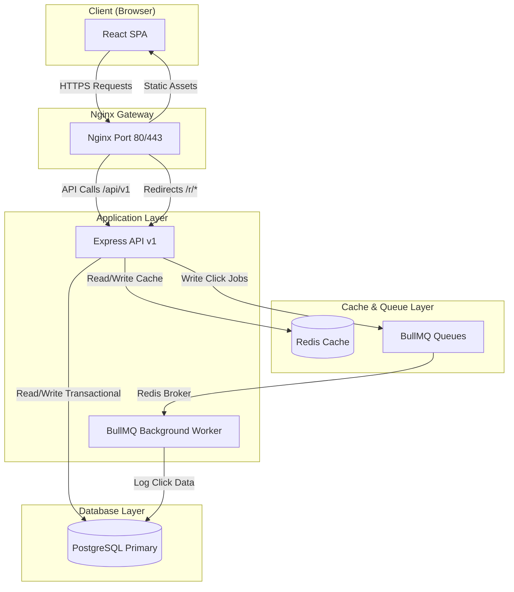
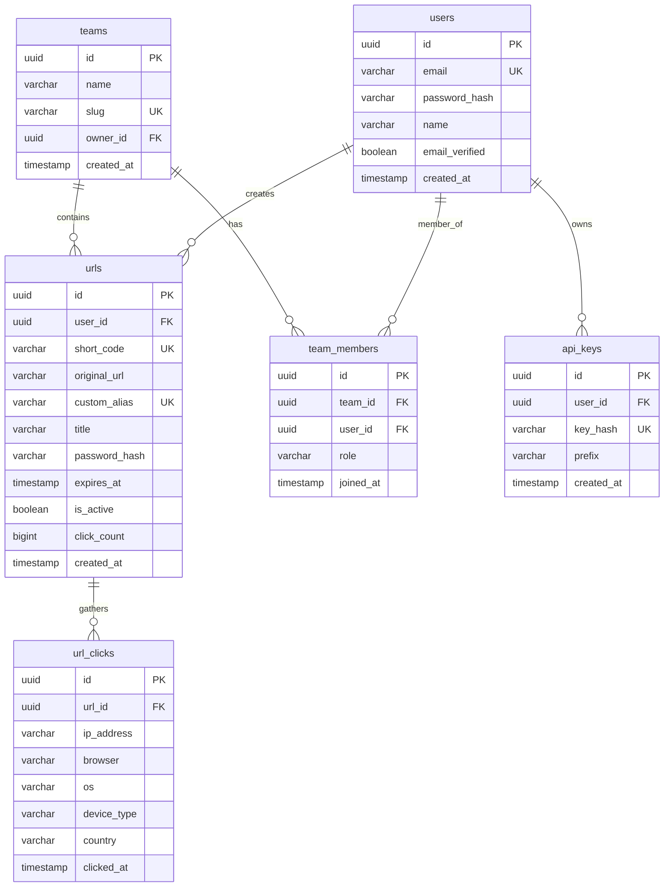

# System Architecture & Design

This document details the architectural layout, core systems, database design, and performance optimizations of the **Linkly URL Management Platform**.

---

## 1. High-Level System Design

Linkly is structured as a decoupled, multi-container system with:
1. **Frontend (React + Vite)**: A single page application serving client interfaces.
2. **Reverse Proxy (Nginx)**: Directs client requests, terminates SSL, enforces caching, and applies initial rate limits.
3. **Backend API (Express + TypeScript)**: Enforces business rules, validates tokens, handles database reads, and coordinates job queues.
4. **Analytical Worker (BullMQ + Redis)**: Asynchronously logs URL clicks and performs background cleanups.
5. **Data Layer (PostgreSQL + Redis)**: Primary transactional database paired with an in-memory key-value cache.



---

## 2. Component Breakdown

### A. Frontend Client
- **React 18** with **Vite** as build tooling and compiler.
- **Tailwind CSS** for layout styling and dark-mode states.
- **React Query (TanStack Query v5)** for API state synchronization, caching, and auto-refetching.
- **Recharts** for visualizing click volume, geolocations, browsers, and devices.
- **Axios** with response interceptors to automatically renew access tokens using refresh tokens when encountering `401 Unauthorized` responses.

### B. Backend API Server
- **Node.js (v20) + Express** written entirely in **TypeScript**.
- **pg (node-postgres)**: Direct raw SQL interaction with connection pooling for maximum throughput and minimal overhead compared to heavy ORMs.
- **Zod**: Input parsing and strict request schema verification.
- **JWT (JsonWebTokens)**: Token-based authentication with `AccessToken` (15m expiry, memory) and `RefreshToken` (7d expiry, stored in DB/Redis).
- **Redis Integration**: Implements a cache-aside pattern to save database lookups on hot URL redirections.

### C. Queue Architecture & Workers
To handle redirection throughput at scale, redirection click tracking is deferred to a background queue rather than blocking the user's redirect response.
1. When a user requests `/r/:shortCode`, the API fetches the destination URL (from Redis if cached).
2. The API immediately responds with a `302 Found` redirect.
3. Simultaneously, it fires a click tracking job to the `click-queue` managed by **BullMQ** on Redis.
4. An isolated Node.js background worker pops the job, parses the user agent string, retrieves geolocation data from the client IP (using `geoip-lite`), and records the click record into PostgreSQL.

---

## 3. Database Schema Design

The transactional store uses PostgreSQL. Database entities are organized into normalized tables with strict constraints:



### Key Performance Indexes:
- `idx_urls_short_code`: B-Tree index on `urls(short_code)` for O(1) redirection lookups.
- `idx_urls_custom_alias`: B-Tree index on `urls(custom_alias)` for alias mapping checks.
- `idx_url_clicks_url_id`: B-Tree index on `url_clicks(url_id)` for quick analytics retrievals.
- `idx_team_members_lookup`: Compound unique index on `team_members(team_id, user_id)` for verification.

---

## 4. Cache-Aside Redirection Pattern

For high performance, the platform implements a dual Redis-DB architecture for redirects:

```
[Client GET /r/abc]
         │
         ▼
 ┌───────────────┐
 │  Check Redis  │ ────(Found)────► [Immediate 302 Redirect]
 └───────────────┘                          │
         │ (Miss)                           │ (Trigger async)
         ▼                                  ▼
 ┌───────────────┐                  ┌───────────────┐
 │ Fetch from DB │                  │ Queue BullMQ  │
 └───────────────┘                  │ Click Job     │
         │                          └───────────────┘
         ▼                                  │
 ┌───────────────┐                          ▼
 │ Write Cache   │                  ┌───────────────┐
 │ (1 hour TTL)  │                  │ Background    │
 └───────────────┘                  │ Click Worker  │
         │                          └───────────────┘
         ▼                                  │
 [Immediate 302 Redirect]                   ▼
                                    [Save click to PG]
```

Cache invalidation is applied on:
- URL configuration edits (invalidates the Redis key).
- URL deletion (deletes the Redis key).
- Expiration check routines.
